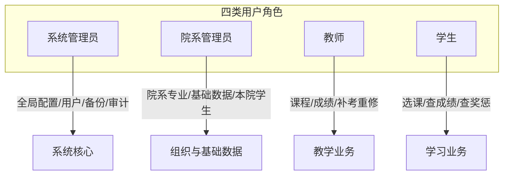
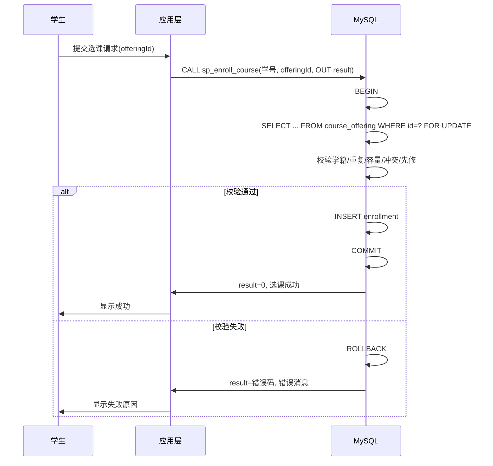
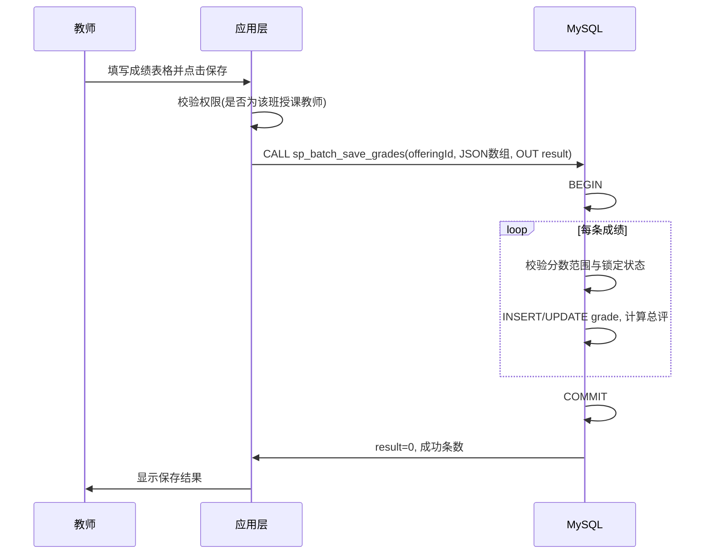
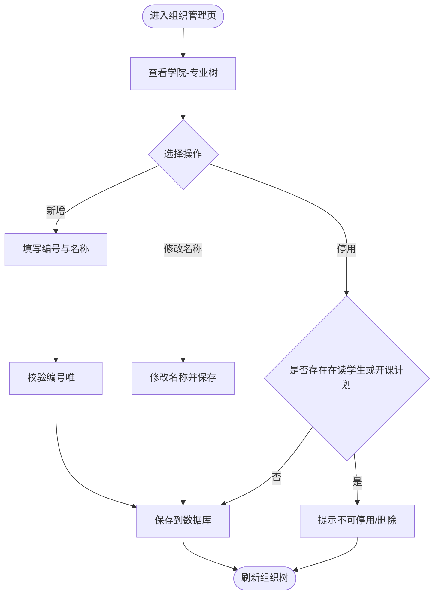
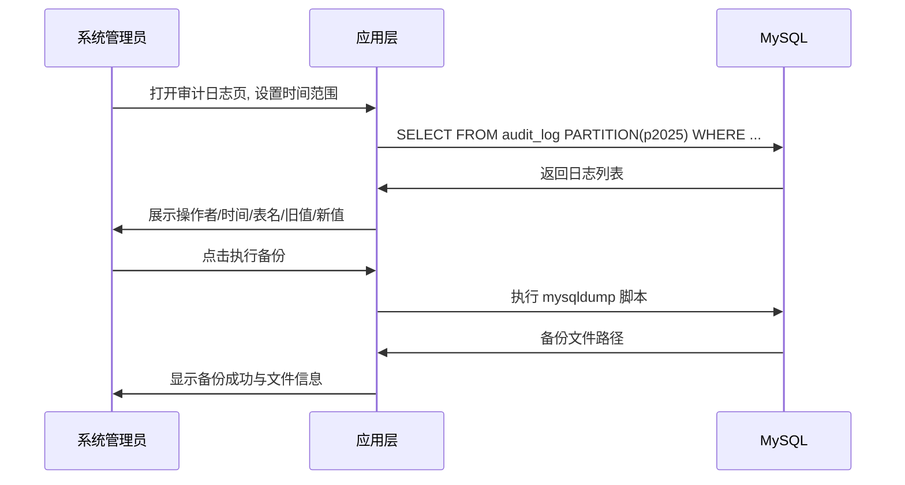
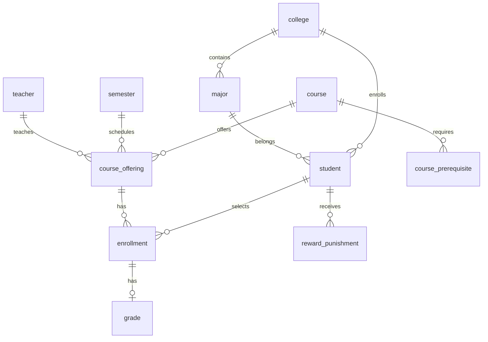

# 学生专业学习管理信息系统 — 需求规格说明书

| 项目 | 说明 |
|------|------|
| 文档版本 | v1.0 |
| 编写日期 | 2026-06-27 |
| 数据库平台 | MySQL 8.0+ |
| 文档状态 | 初稿 |

---

## 目录

1. [项目概述](#1-项目概述)
2. [术语与角色](#2-术语与角色)
3. [功能需求](#3-功能需求)
4. [交互与用例](#4-交互与用例)
5. [数据需求概要](#5-数据需求概要)
6. [高阶数据库技术需求](#6-高阶数据库技术需求)
7. [报表与统计](#7-报表与统计)
8. [非功能需求](#8-非功能需求)
9. [前端界面要求](#9-前端界面要求)
10. [验收标准](#10-验收标准)

---

## 1. 项目概述

### 1.1 项目背景

学生专业学习管理信息系统面向高等院校，用于统一管理学生学籍档案、院系专业结构、课程开设、选课、考试与成绩、补考重修、奖惩记录等核心业务数据。系统以 **MySQL 数据库设计与高阶数据库技术应用** 为核心建设目标，前端仅提供最基本的功能操作入口，用于验证后端数据库功能。

### 1.2 建设目标

1. 准确记录与查询学生基本信息及每一次奖惩情况。
2. 支持院系、专业的层级化管理。
3. 完成课程库、开课计划、选课、考试、补考重修的全流程数据管理。
4. 提供统计查询、报表生成与打印能力。
5. 实现应用层与数据库层双重用户权限控制。
6. 在业务场景中落地 **8 项及以上** 高阶 MySQL 数据库技术，并可在课程报告中验证有效性。

### 1.3 项目范围

**包含：**

- 学生、教师、院系组织、课程、选课、成绩、奖惩等业务模块的增删改查。
- 基础数据字典维护。
- 统计报表与打印。
- 用户权限管理、异常处理、审计与备份策略设计。
- 简易 Web 前端（表单、按钮、列表），用于演示数据库功能。

**不包含：**

- 复杂 UI 设计与交互优化。
- 移动端、消息推送、在线支付等扩展功能。
- 本阶段的具体框架选型、DDL 脚本与业务代码实现。

### 1.4 技术约束

| 约束项 | 说明 |
|--------|------|
| 数据库 | MySQL 8.0 及以上 |
| 前端 | 简易 Web 页面，满足 CRUD 与报表展示即可 |
| 后端 | 待定（后续设计阶段确定），需能调用存储过程、事务及视图 |
| 部署 | 单机或小规模部署，支持演示与测试 |

### 1.5 需求编号体系

| 前缀 | 含义 | 示例 |
|------|------|------|
| FR- | 功能需求 | FR-01 |
| UC- | 用例 | UC-01 |
| NFR- | 非功能需求 | NFR-01 |
| RPT- | 报表 | RPT-01 |
| DB-Tech- | 高阶数据库技术 | DB-Tech-01 |
| EX- | 异常 | EX-01 |

---

## 2. 术语与角色

### 2.1 术语表

| 术语 | 定义 |
|------|------|
| 学号 | 学生唯一标识，全校唯一 |
| 开课计划 | 某学期某门课程的具体教学班，含授课教师、容量、时间等 |
| 选课记录 | 学生与开课计划之间的关联记录 |
| 总评成绩 | 根据平时成绩与期末成绩加权计算后的最终分数 |
| 补考 | 正常考试不及格后的再次考试 |
| 重修 | 补考仍不及格或自愿重新学习，需重新选课并标记为重修 |
| 逻辑删除 | 记录标记为已删除但不物理移除，保留历史关联 |
| 院系 | 学院，组织架构的一级单位 |
| 专业 | 学院下的培养专业 |

### 2.2 用户角色

系统定义四类用户角色，权限遵循 **最小必要原则**。



| 角色 | 代码 | 主要职责 | 典型操作 |
|------|------|----------|----------|
| 系统管理员 | SYS_ADMIN | 全局用户与权限、系统参数、备份恢复、审计查看 | 创建账号、分配角色、执行备份、查看审计日志 |
| 院系管理员 | DEPT_ADMIN | 本院系组织架构、本院学生档案与奖惩 | 维护学院/专业、管理本院学生、登记奖惩 |
| 教师 | TEACHER | 所授课程与教学班、成绩录入、补考重修安排 | 维护开课计划、登记/修改成绩、查看班级统计 |
| 学生 | STUDENT | 个人学习事务 | 选课/退课、查询成绩与奖惩、打印成绩单 |

### 2.3 权限分层

| 层级 | 机制 | 说明 |
|------|------|------|
| 应用层 | RBAC（基于角色的访问控制） | 登录鉴权；菜单与按钮级权限；操作日志 |
| 数据库层 | MySQL 用户 + GRANT/REVOKE | 为四类角色创建独立数据库用户，授予最小必要权限（见 DB-Tech-08） |

### 2.4 角色功能权限矩阵

| 功能模块 | 系统管理员 | 院系管理员 | 教师 | 学生 |
|----------|:----------:|:----------:|:----:|:----:|
| 学生信息管理（全校） | 读/写 | 本院读/写 | 所教班只读 | 本人只读 |
| 奖惩管理 | 读 | 本院读/写 | — | 本人只读 |
| 院系专业管理 | 读/写 | 本院读/写 | 只读 | — |
| 基础数据维护 | 读/写 | 只读 | 只读 | — |
| 课程库管理 | 读/写 | 本院读/写 | 只读 | 只读 |
| 开课计划管理 | 读/写 | 本院读/写 | 本人读/写 | 只读 |
| 选课/退课 | — | — | — | 本人读/写 |
| 成绩录入 | 读/写（解锁） | 本院只读 | 所教班读/写 | 本人只读 |
| 补考/重修管理 | 读/写 | 本院读/写 | 所教班读/写 | 本人申请/只读 |
| 报表统计 | 全部 | 本院范围 | 所教班范围 | 本人范围 |
| 用户权限管理 | 读/写 | — | — | — |
| 审计日志/备份 | 读/执行 | — | — | — |

> **说明**：「—」表示无权限；「只读」含列表与详情查询；教师「所教班」指其担任授课教师的开课计划下的学生数据。

---

## 3. 功能需求

### FR-01 学生信息管理

#### 3.1.1 功能描述

系统应能准确记录和查询学生信息，支持全生命周期的学籍档案管理。

#### 3.1.2 数据字段

| 字段 | 类型要求 | 必填 | 说明 |
|------|----------|:----:|------|
| 学号 | 字符串，唯一 | 是 | 全校唯一标识 |
| 姓名 | 字符串 | 是 | |
| 所属学院 | 外键 | 是 | 关联 college |
| 所属专业 | 外键 | 是 | 关联 major |
| 单位 | 字符串 | 否 | 行政或培养单位名称 |
| 年龄 | 整数 | 是 | 范围 15–50 |
| 性别 | 枚举 | 是 | 男/女/其他（字典维护） |
| 身份证号 | 字符串 | 是 | 加密存储，界面脱敏展示 |
| 入学年份 | 整数 | 是 | 如 2024 |
| 学籍状态 | 枚举 | 是 | 在读/休学/毕业/退学 |
| 联系电话 | 字符串 | 否 | |
| 电子邮箱 | 字符串 | 否 | |
| 备注 | 文本 | 否 | |

#### 3.1.3 功能操作

| 操作 | 执行角色 | 说明 |
|------|----------|------|
| 新增学生 | 院系管理员、系统管理员 | 校验学号唯一、身份证格式 |
| 修改学生 | 院系管理员、系统管理员 | 不可修改学号 |
| 查询学生 | 全部（按权限范围） | 支持学号、姓名、院系、专业、学籍状态组合查询 |
| 逻辑删除 | 院系管理员、系统管理员 | 标记 deleted=1，保留历史选课/成绩 |
| 批量导入 | 院系管理员、系统管理员 | 可选，Excel/CSV 模板导入 |

#### 3.1.4 业务规则

- BR-01-01：学号全校唯一，不可重复。
- BR-01-02：身份证号须符合 18 位格式校验；库内 AES 加密存储（见 DB-Tech-10）。
- BR-01-03：界面展示身份证号时脱敏，如 `110***********1234`。
- BR-01-04：已存在选课或成绩记录的学生不可物理删除。
- BR-01-05：学籍状态为「毕业」或「退学」的学生不可选课。

#### 3.1.5 输入/输出

- **输入**：查询条件（学号、姓名、院系 ID 等）；学生表单字段。
- **输出**：学生列表（分页）；学生详情；操作成功/失败提示。

---

### FR-02 奖惩管理

#### 3.2.1 功能描述

系统应能准确记录学生每一次奖惩情况，支持查询与统计。

#### 3.2.2 数据字段

| 字段 | 类型要求 | 必填 | 说明 |
|------|----------|:----:|------|
| 记录编号 | 自增主键 | — | |
| 学生 | 外键 | 是 | 关联 student |
| 类型 | 枚举 | 是 | 奖励 / 惩罚 |
| 级别 | 枚举 | 是 | 如：校级、院级、班级（字典维护） |
| 原因 | 文本 | 是 | |
| 发生日期 | 日期 | 是 | |
| 记录人 | 外键 | 是 | 关联 sys_user |
| 备注 | 文本 | 否 | |
| 归档状态 | 布尔 | 是 | 默认未归档 |

#### 3.2.3 功能操作

| 操作 | 执行角色 | 说明 |
|------|----------|------|
| 登记奖惩 | 院系管理员 | 必须关联有效在读或历史学生 |
| 修改奖惩 | 院系管理员 | 仅未归档记录可修改 |
| 查询奖惩 | 院系管理员、学生（本人） | 按学生、类型、时间范围、级别筛选 |
| 统计汇总 | 院系管理员 | 按院系/专业/类型/时间段统计次数 |

#### 3.2.4 业务规则

- BR-02-01：每条奖惩必须关联有效学生记录。
- BR-02-02：归档后的奖惩记录不可修改，仅可查看。
- BR-02-03：学生仅可查看本人的奖惩记录。

---

### FR-03 院系与专业管理

#### 3.3.1 功能描述

系统应对学校院系情况进行管理，包括设置学院名称、修改专业名称及组织层级关系。

#### 3.3.2 组织层级

```
学校 → 学院（college）→ 专业（major）
```

#### 3.3.3 数据字段

**学院**

| 字段 | 说明 |
|------|------|
| 学院编号 | 唯一 |
| 学院名称 | 可修改 |
| 状态 | 启用/停用 |

**专业**

| 字段 | 说明 |
|------|------|
| 专业编号 | 唯一 |
| 专业名称 | 可修改 |
| 所属学院 | 外键 |
| 状态 | 启用/停用 |

#### 3.3.4 功能操作

| 操作 | 执行角色 | 说明 |
|------|----------|------|
| 新增学院/专业 | 系统管理员、院系管理员 | 编号唯一 |
| 修改名称 | 系统管理员、院系管理员 | 支持修改学院名、专业名 |
| 调整隶属关系 | 系统管理员 | 如专业更换所属学院 |
| 停用 | 系统管理员、院系管理员 | 停用后不可用于新业务 |
| 查询组织树 | 全部（按权限） | 树形或级联展示 |

#### 3.3.5 业务规则

- BR-03-01：存在在读学生或有效开课计划的组织单元不可物理删除。
- BR-03-02：停用的学院/专业不可用于新增学生或新开课计划。
- BR-03-03：院系管理员仅可管理本院系范围内的组织数据。

---

### FR-04 基础数据维护

#### 3.4.1 功能描述

系统应能对基础字典数据进行统一维护，供各业务模块引用。

#### 3.4.2 字典类型清单

| 字典类型 | 示例值 |
|----------|--------|
| 性别 | 男、女 |
| 学籍状态 | 在读、休学、毕业、退学 |
| 奖惩类型 | 奖励、惩罚 |
| 奖惩级别 | 校级、院级、班级 |
| 课程性质 | 必修、选修、公选 |
| 考试类型 | 正常、补考、重修 |
| 学期 | 2024-2025-1、2024-2025-2 |
| 年级 | 2022、2023、2024 |
| 开课计划状态 | 草稿、开放选课、选课结束、已结束 |

#### 3.4.3 功能操作

| 操作 | 执行角色 | 说明 |
|------|----------|------|
| 字典类型 CRUD | 系统管理员 | 管理 dict_type |
| 字典项 CRUD | 系统管理员 | 管理 dict_item |
| 启用/停用 | 系统管理员 | 停用项不可用于新业务 |
| 查询字典 | 全部 | 下拉框数据源 |

#### 3.4.4 业务规则

- BR-04-01：已被业务数据引用的字典项不可物理删除，仅可停用。
- BR-04-02：字典项在同一类型下编码唯一。

---

### FR-05 课程管理

#### 3.5.1 功能描述

系统应能对开设的课程进行管理，包括课程库维护与每学期开课计划发布。

#### 3.5.2 课程库字段

| 字段 | 必填 | 说明 |
|------|:----:|------|
| 课程编号 | 是 | 唯一 |
| 课程名称 | 是 | |
| 学分 | 是 | 大于 0 |
| 学时 | 是 | 大于 0 |
| 开课院系 | 是 | 外键 college |
| 课程性质 | 是 | 字典：必修/选修/公选 |
| 先修课程 | 否 | 多选，M-N 自关联 |
| 课程简介 | 否 | 文本 |
| 状态 | 是 | 启用/停用 |

#### 3.5.3 开课计划字段

| 字段 | 必填 | 说明 |
|------|:----:|------|
| 开课计划 ID | — | 主键 |
| 课程 | 是 | 外键 course |
| 学期 | 是 | 外键 semester |
| 授课教师 | 是 | 外键 teacher |
| 容量上限 | 是 | 正整数 |
| 已选人数 | 是 | 系统自动维护 |
| 上课时间 | 否 | 简化字符串，如「周一 1-2 节」 |
| 上课地点 | 否 | |
| 状态 | 是 | 草稿/开放选课/选课结束/已结束 |

#### 3.5.4 功能操作

| 操作 | 执行角色 | 说明 |
|------|----------|------|
| 课程库 CRUD | 系统管理员、院系管理员 | |
| 先修课程设置 | 系统管理员、院系管理员 | 多选关联 |
| 发布开课计划 | 院系管理员、教师 | 指定学期、教师、容量 |
| 开放/关闭选课 | 院系管理员 | 状态流转 |
| 查询课程/开课计划 | 全部（按权限） | 多条件筛选 |

#### 3.5.5 业务规则

- BR-05-01：同一课程同一学期同一教师可开设多个教学班（不同 offering）。
- BR-05-02：已选人数由触发器或存储过程自动维护，不可手动篡改（见 DB-Tech-02）。
- BR-05-03：仅「开放选课」状态的开课计划允许学生选课。

---

### FR-06 选课 / 考试 / 补考重修

#### 3.6.1 选课管理

**功能描述**：学生可在选课期内浏览并选择课程，系统校验后写入选课记录。

**操作流程**：

1. 学生查看当前学期「开放选课」的开课计划列表。
2. 选择目标课程，提交选课请求。
3. 系统校验：学籍状态、是否重复选课、容量、时间冲突、先修课程。
4. 校验通过则写入 enrollment，更新已选人数；否则返回失败原因。
5. 选课期内支持退课，退课后释放名额。

**业务规则**：

- BR-06-01：同一学生同一开课计划不可重复选课。
- BR-06-02：已选人数不得超过容量上限（事务 + 行锁保证，见 DB-Tech-05）。
- BR-06-03：选课前须满足所有先修课程已通过（总评 ≥ 60）。
- BR-06-04：退课仅允许在「开放选课」期内。

#### 3.6.2 考试与成绩管理

**数据字段（grade）**：

| 字段 | 说明 |
|------|------|
| 选课记录 | 外键 enrollment，1:1 |
| 平时成绩 | 0–100，可选 |
| 期末成绩 | 0–100，可选 |
| 总评成绩 | 系统计算或教师录入，0–100 |
| 考试类型 | 正常/补考/重修 |
| 录入教师 | 外键 teacher |
| 录入时间 | 时间戳 |
| 锁定状态 | 未提交/已提交 |

**功能操作**：

| 操作 | 执行角色 | 说明 |
|------|----------|------|
| 录入成绩 | 教师 | 单条或批量 |
| 提交成绩 | 教师 | 提交后锁定，教师不可再改 |
| 修改已提交成绩 | 系统管理员 | 需记录审计日志 |
| 查询成绩 | 教师、学生、院系管理员 | 按权限范围 |

**业务规则**：

- BR-06-05：成绩须在 0–100 范围内。
- BR-06-06：总评成绩默认按权重计算（如平时 30% + 期末 70%），可配置。
- BR-06-07：已提交成绩仅系统管理员可修改，且须写入 grade_change_log（见 DB-Tech-02）。

#### 3.6.3 补考管理

- 正常考试总评 < 60 分的学生，系统自动或教师手动加入补考名单。
- 补考单独记录成绩，exam_type = 补考，关联原 enrollment。
- 补考成绩 ≥ 60 视为通过，成绩单标注「补考通过」。

#### 3.6.4 重修管理

- 补考仍不及格或学生主动申请重修，由院系管理员或教师安排重修班。
- 生成新的 enrollment，标记 is_retake = 1。
- 重修成绩独立记录，不影响原记录，但学分仅计一次。

---

### FR-07 统计 / 查询 / 报表 / 打印

#### 3.7.1 功能描述

系统应提供强大的数据统计、多维度查询、报表生成及打印功能。

#### 3.7.2 统计维度

- 按院系、专业
- 按学期、课程、教师
- 按学籍状态、奖惩类型
- 时间范围（学年、学期）

#### 3.7.3 统计指标

| 指标 | 说明 |
|------|------|
| 学生人数 | 按院系/专业/年级统计 |
| 选课人数 | 按课程/开课计划统计 |
| 平均分 / 及格率 | 按课程/专业/班级统计 |
| 奖惩次数 | 按类型/级别/时间段统计 |
| 不及格人数 | 按课程/学期统计 |
| 成绩排名 | 专业内/课程内排名（窗口函数） |

#### 3.7.4 输出要求

- 页面表格展示查询结果。
- 支持打印友好 HTML 布局（浏览器打印或后端生成 PDF）。
- 管理员可导出 CSV（可选）。

---

### FR-08 用户权限管理

#### 3.8.1 功能描述

系统应实现应用层与数据库层双重权限管理。

#### 3.8.2 应用层

| 功能 | 说明 |
|------|------|
| 用户账号管理 | 创建、停用、重置密码 |
| 角色分配 | 用户与角色多对多 |
| 登录认证 | 用户名 + 密码，密码 bcrypt 哈希存储 |
| 会话管理 | 登录态维持与超时退出 |
| 操作日志 | 记录登录失败、越权访问 |

#### 3.8.3 数据库层

- 创建 `db_admin`、`db_dept`、`db_teacher`、`db_student` 四个 MySQL 用户。
- 按角色授予表级/列级最小权限（详见 DB-Tech-08）。

#### 3.8.4 业务规则

- BR-08-01：系统至少保留一个系统管理员账号。
- BR-08-02：停用用户不可登录，但保留历史操作记录。

---

### FR-09 异常处理

#### 3.9.1 功能描述

系统应对业务异常与系统异常进行统一分类、捕获与友好提示。

#### 3.9.2 统一错误响应结构

```json
{
  "code": "EX-01001",
  "message": "选课失败：该课程已满员",
  "detail": "courseOfferingId=1001, capacity=50, enrolled=50"
}
```

#### 3.9.3 异常分类表

| 编号 | 分类 | 场景 | 处理方式 | 用户提示 |
|------|------|------|----------|----------|
| EX-01 | 业务-选课 | 课程已满员 | 事务回滚 | 该课程已满员，请选择其他教学班 |
| EX-02 | 业务-选课 | 重复选课 | 拒绝插入 | 您已选择该课程 |
| EX-03 | 业务-选课 | 先修课未通过 | 拒绝插入 | 您尚未通过先修课程：{courseName} |
| EX-04 | 业务-选课 | 时间冲突 | 拒绝插入 | 与已选课程时间冲突 |
| EX-05 | 业务-选课 | 学籍不允许 | 拒绝插入 | 当前学籍状态不允许选课 |
| EX-06 | 业务-成绩 | 分数超范围 | 拒绝保存 | 成绩须在 0–100 之间 |
| EX-07 | 业务-成绩 | 已锁定不可改 | 拒绝更新 | 成绩已提交，请联系管理员 |
| EX-08 | 业务-组织 | 存在关联不可删 | 拒绝删除 | 该院系下存在在读学生，无法删除 |
| EX-09 | 系统-数据库 | 连接失败 | 记录日志，返回 500 | 系统繁忙，请稍后重试 |
| EX-10 | 系统-并发 | 死锁 | 自动重试 ≤ 3 次 | 操作冲突，请重试 |
| EX-11 | 系统-权限 | 越权访问 | 记录日志，返回 403 | 您没有权限执行此操作 |
| EX-12 | 系统-认证 | 登录失败 | 记录日志 | 用户名或密码错误 |

---

## 4. 交互与用例

### 4.1 用例清单

| 编号 | 用例名称 | 主要角色 | 关联功能 |
|------|----------|----------|----------|
| UC-01 | 学生选课 | 学生 | FR-06 |
| UC-02 | 教师批量登记成绩 | 教师 | FR-06 |
| UC-03 | 院系管理员维护组织架构 | 院系管理员 | FR-03 |
| UC-04 | 院系管理员登记奖惩 | 院系管理员 | FR-02 |
| UC-05 | 系统管理员管理用户 | 系统管理员 | FR-08 |
| UC-06 | 系统管理员查看审计日志 | 系统管理员 | DB-Tech-09 |
| UC-07 | 学生查询个人成绩 | 学生 | FR-06、FR-07 |
| UC-08 | 院系管理员生成报表 | 院系管理员 | FR-07 |

### 4.2 核心交互流程

#### UC-01 学生选课（含事务与并发控制）



#### UC-02 教师批量登记成绩（存储过程入口）



#### UC-03 院系管理员维护组织架构



#### UC-04 系统管理员查看审计日志 / 执行备份



---

## 5. 数据需求概要

> 本章描述逻辑数据模型，供后续 ER 图与 DDL 设计使用。预计 **19 张业务表**。

### 5.1 实体清单

#### 组织域

| 表名 | 说明 | 主要字段 |
|------|------|----------|
| college | 学院 | id, code, name, status |
| major | 专业 | id, code, name, college_id, status |

#### 人员域

| 表名 | 说明 | 主要字段 |
|------|------|----------|
| student | 学生 | id, student_no, name, college_id, major_id, age, gender, id_card_enc, id_card_hash, enroll_year, status, deleted |
| teacher | 教师 | id, teacher_no, name, college_id, title, phone |
| sys_user | 系统用户 | id, username, password_hash, real_name, status |
| role | 角色 | id, code, name |
| user_role | 用户角色关联 | user_id, role_id |

#### 教学域

| 表名 | 说明 | 主要字段 |
|------|------|----------|
| course | 课程库 | id, code, name, credit, hours, college_id, nature, status |
| course_prerequisite | 先修关系 | course_id, prereq_course_id |
| semester | 学期 | id, code, name, start_date, end_date |
| course_offering | 开课计划 | id, course_id, semester_id, teacher_id, capacity, enrolled_count, schedule, location, status |
| enrollment | 选课记录 | id, student_id, offering_id, enroll_time, status, is_retake |
| grade | 成绩 | id, enrollment_id, usual_score, final_score, total_score, exam_type, teacher_id, locked, academic_year |
| makeup_exam | 补考记录 | id, enrollment_id, grade_id, exam_date, status |
| retake_record | 重修记录 | id, original_enrollment_id, new_enrollment_id, apply_time, status |

#### 学籍域

| 表名 | 说明 | 主要字段 |
|------|------|----------|
| reward_punishment | 奖惩 | id, student_id, type, level, reason, occur_date, recorder_id, archived |

#### 基础域

| 表名 | 说明 | 主要字段 |
|------|------|----------|
| dict_type | 字典类型 | id, code, name |
| dict_item | 字典项 | id, type_id, code, label, sort, status |

#### 系统域

| 表名 | 说明 | 主要字段 |
|------|------|----------|
| audit_log | 审计日志（分区表） | id, table_name, operation, record_id, old_value, new_value, operator, operate_time, academic_year |
| grade_change_log | 成绩变更日志 | id, grade_id, old_scores, new_scores, operator, change_time |
| operation_log | 应用操作日志 | id, user_id, action, ip, result, create_time |
| backup_record | 备份记录元数据 | id, backup_type, file_path, file_size, start_time, end_time, status |

### 5.2 核心关系



| 关系 | 基数 | 说明 |
|------|------|------|
| 学生 — 开课计划 | N:M | 通过 enrollment 关联 |
| 选课 — 成绩 | 1:1 | 一条选课对应一条主成绩记录 |
| 课程 — 先修课程 | M:N | course_prerequisite 中间表 |
| 用户 — 角色 | M:N | user_role 中间表 |

### 5.3 完整性约束

| 约束类型 | 应用示例 |
|----------|----------|
| 主键 | 每表 id 自增主键 |
| 外键 | enrollment.student_id → student.id；grade.enrollment_id → enrollment.id |
| 唯一 | student.student_no；course.code；enrollment(student_id, offering_id) |
| CHECK | grade 各分数 BETWEEN 0 AND 100；student.age BETWEEN 15 AND 50 |
| 默认值 | created_at DEFAULT CURRENT_TIMESTAMP；grade.locked DEFAULT 0 |
| 非空 | 核心业务字段 NOT NULL |

### 5.4 范式说明

- 设计以 **第三范式（3NF）** 为主：组织、人员、课程、选课、成绩分表存储，避免冗余。
- 报表所需的汇总数据通过 **视图** 或 **窗口函数查询** 实现，不在业务表中重复存储。
- 身份证号仅存加密字段与哈希字段，明文不落库。

---

## 6. 高阶数据库技术需求

本章定义 **8 项核心高阶技术** 及 **2 项扩展技术**，均需在业务场景中有实际应用价值，并可在课程报告中验证。

> 详细验证思路与报告素材见 [附录-高阶数据库技术说明.md](./附录-高阶数据库技术说明.md)。

### DB-Tech-01 存储过程

| 项 | 内容 |
|----|------|
| 应用场景 | 选课业务封装；批量成绩录入与总评计算 |
| 对象 | `sp_enroll_course(IN p_student_no, IN p_offering_id, OUT p_result, OUT p_message)`；`sp_batch_save_grades(IN p_offering_id, IN p_grades_json, OUT p_result, OUT p_count)` |
| 触发时机 | 应用层收到选课/保存成绩请求时 CALL |
| 预期效果 | 复杂校验与多表写入封装在数据库内，保证原子性 |
| 验收标准 | 至少 1 个存储过程含 IN/OUT 参数；前端或后端成功调用并返回结果码 |
| 关联功能 | FR-06、UC-01、UC-02 |

### DB-Tech-02 触发器

| 项 | 内容 |
|----|------|
| 应用场景 | 选课后自动维护已选人数；成绩修改时写入变更日志 |
| 对象 | `trg_enrollment_after_insert/delete` 更新 course_offering.enrolled_count；`trg_grade_after_update` 写入 grade_change_log |
| 触发时机 | enrollment INSERT/DELETE；grade UPDATE |
| 预期效果 | 业务层无需手动维护计数与日志 |
| 验收标准 | 至少 2 类 DML 触发场景可演示 |
| 关联功能 | FR-05、FR-06 |

### DB-Tech-03 视图

| 项 | 内容 |
|----|------|
| 应用场景 | 封装复杂成绩查询；敏感字段脱敏 |
| 对象 | `v_student_grade_summary`（学生-课程-成绩 JOIN）；`v_student_public`（身份证脱敏，隐藏 id_card_enc） |
| 触发时机 | 报表查询、学生列表展示时 SELECT |
| 预期效果 | 简化应用 SQL；非授权角色仅能访问脱敏视图 |
| 验收标准 | 至少 2 个视图，其中 1 个含多表 JOIN，1 个实现脱敏 |
| 关联功能 | FR-01、FR-07 |

### DB-Tech-04 索引优化

| 项 | 内容 |
|----|------|
| 应用场景 | 学生学号查询、选课记录查询、成绩按班查询 |
| 对象 | `idx_student_no` UNIQUE；`idx_enrollment_student_offering`；`idx_grade_offering` |
| 触发时机 | 高频 SELECT 与 JOIN |
| 预期效果 | 显著降低全表扫描 |
| 验收标准 | 提供 EXPLAIN 对比截图与计时结果（索引创建前后） |
| 关联功能 | FR-01、FR-06、FR-07 |

### DB-Tech-05 事务与并发控制

| 项 | 内容 |
|----|------|
| 应用场景 | 选课扣减名额，防止超员 |
| 机制 | `BEGIN` → `SELECT ... FOR UPDATE` → 校验 → `INSERT` → `COMMIT`；隔离级别 REPEATABLE READ；死锁重试 |
| 触发时机 | 并发选课同一热门课程 |
| 预期效果 | 已选人数永不超过 capacity |
| 验收标准 | 模拟 ≥10 并发选课，最终 enrolled_count ≤ capacity |
| 关联功能 | FR-06、UC-01 |

### DB-Tech-06 窗口函数

| 项 | 内容 |
|----|------|
| 应用场景 | 专业内成绩排名；学生累计获得学分 |
| 示例 SQL 思路 | `RANK() OVER (PARTITION BY major_id ORDER BY total_score DESC)`；`SUM(credit) OVER (PARTITION BY student_id ORDER BY semester_id)` |
| 触发时机 | 报表 RPT-04、RPT-05 生成时 |
| 预期效果 | 无需子查询即可实现排名与累计 |
| 验收标准 | 至少 2 种窗口函数分析场景，结果正确 |
| 关联功能 | FR-07 |

### DB-Tech-07 分区表

| 项 | 内容 |
|----|------|
| 应用场景 | 审计日志、历史成绩按学年分区，提升查询与归档效率 |
| 对象 | `audit_log` 按 `academic_year` RANGE 分区；`grade` 可按 academic_year 分区 |
| 触发时机 | 按学年查询审计日志或历史成绩 |
| 预期效果 | EXPLAIN 显示 partition pruning |
| 验收标准 | 创建 ≥2 个分区；演示分区裁剪查询计划 |
| 关联功能 | DB-Tech-09、RPT-08 |

### DB-Tech-08 数据库用户权限

| 项 | 内容 |
|----|------|
| 应用场景 | 四类角色对应四类 MySQL 用户，最小权限 |
| 对象 | db_admin（ALL）；db_dept（本院学生/组织读写）；db_teacher（成绩读写、课程只读）；db_student（本人选课/成绩只读） |
| 触发时机 | 应用使用不同数据库用户连接 |
| 预期效果 | 越权 SQL 被 MySQL 拒绝 |
| 验收标准 | 演示学生用户 EXECUTE/UPDATE grade 失败 |
| 关联功能 | FR-08 |

### DB-Tech-09 审计日志（扩展）

| 项 | 内容 |
|----|------|
| 应用场景 | 记录 student、grade、enrollment 的全部 DML |
| 对象 | audit_log 表 + 触发器 trg_audit_* |
| 记录内容 | 操作者、操作时间、表名、记录 ID、旧值/新值 JSON |
| 验收标准 | 可追溯一次成绩修改的完整链路 |
| 关联功能 | FR-08、UC-06 |

### DB-Tech-10 数据加密（扩展）

| 项 | 内容 |
|----|------|
| 应用场景 | 身份证号加密存储 |
| 机制 | `AES_ENCRYPT` 存储密文；SHA256 哈希辅助精确匹配；应用层管理密钥 |
| 验收标准 | 库内为密文；界面脱敏；按学号查询不受影响 |
| 关联功能 | FR-01、DB-Tech-03 |

### 6.1 技术实现优先级

| 优先级 | 技术编号 | 说明 |
|--------|----------|------|
| P0 必做 | DB-Tech-01 ~ 08 | 核心 8 项，满足课程 ≥5 项要求 |
| P1 建议 | DB-Tech-09、10 | 审计与加密，提升安全与可追溯性 |
| P2 可选 | 备份恢复、全文检索 | 见附录，时间充裕时可追加 |

---

## 7. 报表与统计

### 7.1 报表清单

| 编号 | 报表名称 | 主要使用者 | 查询参数 | 数据来源 |
|------|----------|------------|----------|----------|
| RPT-01 | 学生基本信息一览 | 院系管理员 | 院系、专业、学籍状态 | student + v_student_public |
| RPT-02 | 学生奖惩记录表 | 院系管理员 | 学生、类型、时间范围 | reward_punishment |
| RPT-03 | 学期选课人数统计 | 教师、院系管理员 | 学期、院系 | enrollment + course_offering |
| RPT-04 | 课程成绩分布表 | 教师 | 开课计划 ID | grade + 窗口函数 |
| RPT-05 | 专业成绩排名榜 | 院系管理员 | 专业、学期 | v_student_grade_summary + RANK() |
| RPT-06 | 不及格/补考名单 | 教师 | 学期、课程 | grade WHERE total_score < 60 |
| RPT-07 | 院系教学汇总 | 院系管理员 | 学期、院系 | 聚合：人数/门数/及格率 |
| RPT-08 | 审计日志查询 | 系统管理员 | 时间范围、表名 | audit_log（分区表） |

### 7.2 报表功能要求

- 每份报表提供参数表单（下拉、日期、文本）。
- 结果以 HTML 表格展示，支持浏览器打印。
- 空结果时提示「暂无数据」。
- 报表数据受角色权限约束，不可跨范围查询。

### 7.3 打印要求

- 打印页包含：报表标题、生成时间、查询条件摘要、制表人（当前用户）。
- 表格列宽适配 A4 纵向打印。
- 页眉页脚可选。

---

## 8. 非功能需求

### NFR-01 性能

| 指标 | 要求 |
|------|------|
| 列表查询响应 | 万级学生、十万级成绩下，常规列表 < 2 秒 |
| 并发选课 | 支持至少 50 并发选课请求 |
| 索引 | 高频查询字段须建立合理索引（DB-Tech-04） |

### NFR-02 安全

| 项 | 要求 |
|----|------|
| 传输 | 生产部署启用 HTTPS |
| 密码 | bcrypt 哈希，不可逆 |
| 身份证 | AES 加密存储，界面脱敏 |
| SQL 注入 | 使用预编译语句 / 存储过程参数 |
| 权限 | 应用层 RBAC + 数据库层 GRANT |

### NFR-03 可靠性与备份

| 项 | 要求 |
|----|------|
| 备份策略 | 每日 mysqldump 全量备份 + binlog 开启 |
| 恢复目标 | RPO ≤ 24 小时；RTO ≤ 4 小时（演示环境） |
| 备份记录 | 写入 backup_record 表 |

### NFR-04 可维护性

- 数据库对象（存储过程、触发器、视图）须有命名规范与注释。
- 需求编号（FR-/DB-Tech- 等）贯穿设计、实现与测试文档。

### NFR-05 兼容性

- MySQL 8.0+。
- 浏览器：Chrome、Edge 最新两个主版本。

---

## 9. 前端界面要求

> 本课程不强调界面美观与复杂交互，前端仅需提供最基本功能入口，能够验证后端数据库功能。

### 9.1 页面清单

| 序号 | 页面 | 主要角色 | 最低交互元素 |
|------|------|----------|--------------|
| P-01 | 登录页 | 全部 | 用户名、密码输入框；登录按钮 |
| P-02 | 学生列表/详情/表单 | 院系管理员 | 查询表单；表格列表；新增/编辑/删除按钮 |
| P-03 | 奖惩登记与查询 | 院系管理员、学生 | 登记表单；按条件查询；列表展示 |
| P-04 | 组织管理 | 院系管理员 | 学院-专业两级树形或级联下拉；新增/修改/停用按钮 |
| P-05 | 字典维护 | 系统管理员 | 字典类型与字典项两个列表；CRUD 按钮 |
| P-06 | 课程库与开课计划 | 院系管理员、教师 | 两个 Tab 或分页；CRUD；发布/开放选课按钮 |
| P-07 | 学生选课 | 学生 | 可选课程列表；已选列表；选课/退课按钮 |
| P-08 | 成绩录入 | 教师 | 学生成绩表格；批量保存；提交锁定按钮 |
| P-09 | 补考/重修管理 | 教师、院系管理员 | 名单列表；安排补考/重修按钮 |
| P-10 | 报表查询 | 全部（按权限） | 报表类型下拉；参数表单；结果表格；打印按钮 |
| P-11 | 用户/角色管理 | 系统管理员 | 用户列表；角色分配；重置密码 |
| P-12 | 审计日志/备份 | 系统管理员 | 日志查询表单；备份执行按钮；备份历史列表 |

### 9.2 页面功能说明

#### P-01 登录页

所有用户进入系统的入口。用户输入用户名和密码后提交登录，系统验证身份并识别角色（系统管理员、院系管理员、教师、学生），随后跳转至该角色对应的功能页面。

**使用角色：** 全部

---

#### P-02 学生管理页

用于管理学生学籍档案，支持查询、新增、修改与逻辑删除。

- **查询**：按学号、姓名、学院、专业、学籍状态等条件搜索学生
- **查看详情**：姓名、学院、专业、年龄、性别、脱敏后的身份证号、入学年份、学籍状态、联系方式等
- **维护**：新增学生、修改信息、逻辑删除（已有关联选课或成绩记录的学生不可物理删除）

**使用角色：**

| 角色 | 权限范围 |
|------|----------|
| 院系管理员 | 本院学生，可增删改查 |
| 系统管理员 | 全校学生，可增删改查 |
| 教师 | 仅所教班级学生，只读 |
| 学生 | 仅本人信息，只读 |

---

#### P-03 奖惩管理页

用于记录和查询学生每一次奖惩情况。

- **登记**：选择学生，填写类型（奖励/惩罚）、级别、原因、日期、备注
- **查询**：按学生、时间范围、类型等条件筛选
- **修改**：仅未归档记录可修改
- **统计**：按院系、类型、时间段汇总奖惩次数

**使用角色：**

| 角色 | 权限范围 |
|------|----------|
| 院系管理员 | 本院学生奖惩，可登记、修改、查询 |
| 学生 | 仅本人奖惩记录，只读 |
| 系统管理员 | 全校奖惩，只读 |

---

#### P-04 组织管理页

用于维护学校组织架构，层级为 **学院 → 专业**（两级）。

- **查看**：以树形或级联方式展示学院与专业
- **新增**：创建学院、专业
- **修改**：修改学院名称、专业名称；系统管理员还可调整专业所属学院
- **停用**：停用学院或专业；存在在读学生或有效开课计划时不可物理删除

**使用角色：**

| 角色 | 权限范围 |
|------|----------|
| 系统管理员 | 全校组织，可增删改 |
| 院系管理员 | 本院相关组织，可增删改 |
| 教师 | 只读 |
| 学生 | 无权限访问 |

---

#### P-05 字典维护页

用于统一维护系统基础字典数据，供各业务模块下拉选项引用。

- **维护内容**：性别、学籍状态、奖惩类型、课程性质、考试类型、学期、年级等
- **操作**：字典类型与字典项的增删改，以及启用/停用（已停用项不可用于新业务）

**使用角色：** 仅系统管理员

---

#### P-06 课程库与开课计划页

分为 **课程库** 与 **开课计划** 两部分，可用 Tab 或分页切换。

**课程库：**

- 维护课程编号、名称、学分、学时、开课院系、课程性质（必修/选修/公选）
- 设置先修课程关系

**开课计划：**

- 为某学期开设具体教学班，指定授课教师、容量上限、上课时间地点
- 发布开课计划，开放或关闭选课

**使用角色：**

| 角色 | 权限范围 |
|------|----------|
| 系统管理员 | 全校课程与开课计划，可增删改 |
| 院系管理员 | 本院课程与开课计划，可增删改 |
| 教师 | 本人授课的课程与开课计划，可维护 |
| 学生 | 只读，查看可选课程信息 |

---

#### P-07 学生选课页

学生进行选课与退课的核心页面。

- **查看**：当前学期可选课程列表、本人已选课程列表
- **选课**：提交选课请求，系统校验容量、重复选课、先修课程、时间冲突、学籍状态
- **退课**：在选课开放期内可退选已选课程

**使用角色：** 仅学生

---

#### P-08 成绩录入页

教师录入所授班级学生成绩。

- **选择班级**：按开课计划筛选本人所教班级
- **录入成绩**：填写平时成绩、期末成绩，系统自动计算总评（如平时 30% + 期末 70%）
- **批量保存**：一次性保存全班成绩
- **提交锁定**：提交后成绩进入锁定状态，教师不可再修改；需修改时由系统管理员操作

**使用角色：**

| 角色 | 权限范围 |
|------|----------|
| 教师 | 所教班级成绩，可录入与修改（未提交前） |
| 系统管理员 | 可修改已锁定成绩（记入审计日志） |
| 院系管理员 | 本院成绩，只读 |

---

#### P-09 补考 / 重修管理页

处理考试不及格后的补考与重修业务。

- **查看不及格名单**：按学期、课程筛选总评不及格学生
- **安排补考**：将不及格学生纳入补考名单，登记补考成绩
- **安排重修**：为学生安排重修班，生成新选课记录并标记为重修

**使用角色：**

| 角色 | 权限范围 |
|------|----------|
| 教师 | 本人所授课程的不及格、补考、重修 |
| 院系管理员 | 本院范围 |
| 系统管理员 | 全校范围 |
| 学生 | 查看本人补考/重修记录；可申请重修（可选） |

---

#### P-10 报表查询页

统一的报表查询与打印入口。用户选择报表类型、填写查询参数后，系统生成结果表格并支持打印。

**可选报表：**

| 报表编号 | 报表名称 |
|----------|----------|
| RPT-01 | 学生基本信息一览 |
| RPT-02 | 学生奖惩记录表 |
| RPT-03 | 学期选课人数统计 |
| RPT-04 | 课程成绩分布表 |
| RPT-05 | 专业成绩排名榜 |
| RPT-06 | 不及格/补考名单 |
| RPT-07 | 院系教学汇总 |
| RPT-08 | 审计日志查询（仅管理员） |

**使用角色：** 全部用户可访问，但可选报表类型与数据范围因角色而异——学生查看本人数据，教师查看所教班级，院系管理员查看本院，系统管理员查看全校。

---

#### P-11 用户 / 角色管理页

用于管理系统登录账号与角色权限。

- **用户管理**：查看用户列表，新增账号，停用账号
- **角色分配**：为用户绑定角色（系统管理员、院系管理员、教师、学生）
- **密码管理**：重置用户密码

**使用角色：** 仅系统管理员

---

#### P-12 审计日志 / 备份页

系统运维页面，用于演示数据库审计与备份恢复相关能力。

**审计日志：**

- 查询关键数据变更记录（如成绩修改、选课删除）
- 按时间范围、表名筛选，展示操作者、操作时间、旧值/新值

**数据备份：**

- 手动触发数据库备份
- 查看备份历史记录（备份类型、文件路径、执行时间、状态）

**使用角色：** 仅系统管理员

---

### 9.3 角色与页面对照

| 角色 | 主要使用页面 |
|------|--------------|
| 学生 | P-01、P-02（本人）、P-03（本人）、P-07、P-10 |
| 教师 | P-01、P-02（所教班）、P-06、P-08、P-09、P-10 |
| 院系管理员 | P-01、P-02、P-03、P-04、P-06、P-09、P-10 |
| 系统管理员 | P-01、P-02、P-05、P-06、P-09、P-10、P-11、P-12 |

### 9.4 通用 UI 要求

- 每页有明确标题与返回/导航链接。
- 操作成功/失败有文字提示。
- 表单必填项有标注。
- 列表支持简单分页（上一页/下一页即可）。
- 无需响应式布局、无需复杂组件库。

---

## 10. 验收标准

### 10.1 课程评分对照（表1）

| 考核项 | 占比 | 验收要点 | 对应文档章节 |
|--------|------|----------|--------------|
| 高阶数据库技术实现 | 50% | 成功实现 ≥5 项（目标 8 项），设计合理，可验证 | 第 6 章、附录 |
| 数据库设计 | 20% | 表结构丰富，主外键/检查约束/默认值正确，范式合理 | 第 5 章 |
| 基础功能 | 20% | 各模块增删改查可用 | 第 3 章 |
| 前端界面 | 10% | 12 个页面可演示数据库功能 | 第 9 章 |

### 10.2 功能验收 Checklist

- [ ] FR-01：学生信息增删改查，身份证加密与脱敏展示
- [ ] FR-02：奖惩登记、查询、统计
- [ ] FR-03：学院/专业管理与停用规则
- [ ] FR-04：字典维护与停用
- [ ] FR-05：课程库与开课计划管理
- [ ] FR-06：选课/退课、成绩录入、补考重修
- [ ] FR-07：8 份报表可查询与打印
- [ ] FR-08：四类角色登录与权限隔离
- [ ] FR-09：业务异常有明确中文提示

### 10.3 高阶技术验收 Checklist

- [ ] DB-Tech-01：存储过程带 IN/OUT，选课或成绩场景可调用
- [ ] DB-Tech-02：触发器自动维护人数与变更日志
- [ ] DB-Tech-03：视图封装复杂查询与脱敏
- [ ] DB-Tech-04：索引优化有 EXPLAIN/计时对比
- [ ] DB-Tech-05：并发选课不超容量
- [ ] DB-Tech-06：窗口函数排名与累计学分
- [ ] DB-Tech-07：分区表与分区裁剪
- [ ] DB-Tech-08：四类 MySQL 用户最小权限
- [ ] DB-Tech-09：审计日志可追溯 DML（扩展）
- [ ] DB-Tech-10：身份证 AES 加密（扩展）

### 10.4 演示建议数据规模

| 数据 | 建议量 | 用途 |
|------|--------|------|
| 学院 | 3–5 | 组织管理演示 |
| 专业 | 10–15 | |
| 学生 | 500–1000 | 索引与窗口函数 |
| 课程 | 50–100 | |
| 开课计划 | 100–200 | 选课并发测试 |
| 选课记录 | 5000+ | 索引优化 |
| 成绩记录 | 5000+ | 分区表、窗口函数 |
| 审计日志 | 10000+ | 分区表演示 |

---

## 附录

- [附录-高阶数据库技术说明.md](./附录-高阶数据库技术说明.md) — 各高阶技术的验证 SQL 思路、报告素材清单与可选扩展技术

---

*文档结束*
